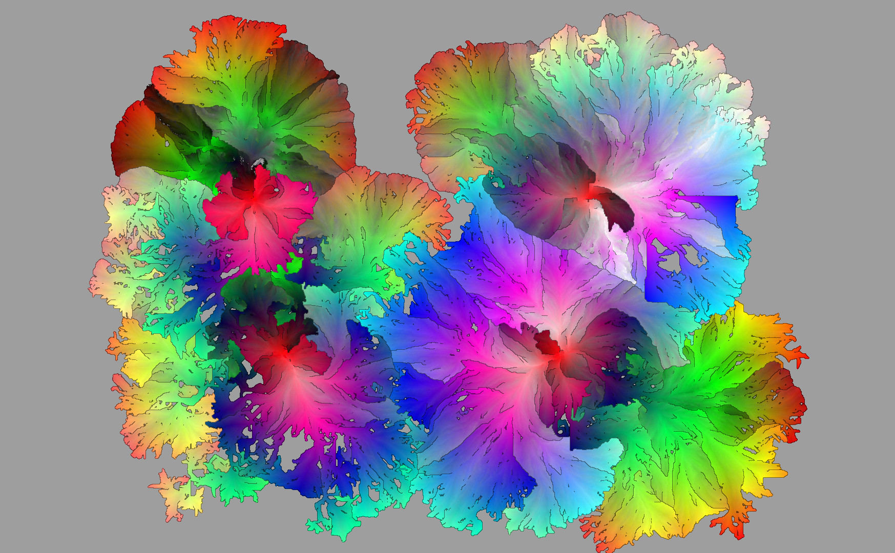

All Colors
==========

A small programm that tries to [draw as many different as possible colors](http://codegolf.stackexchange.com/questions/22144/images-with-all-colors), evenly distributed in the RGB cube, into an pleasent-looking image.
It is heavily based on a great [idea of József Fejes](http://joco.name/2014/03/02/all-rgb-colors-in-one-image/).

[][output]
[output]: doc/all_colors_s0_4_golden_158.jpg

[video on youtube](https://www.youtube.com/watch?v=aVV7a8ueHEo)


Dependencies
------------
- [scons](http://www.scons.org/)
- [OpenCV](http://opencv.org/)

```
sudo apt-get install g++ libopencv-dev scons
```


Compilation
-----------
```
scons
```


Usage
-----
```
./release/AllColors 4
```

Images will be written to the `output` directory. (But prepare to wait quite some time.)

In case you want to create a video from all the images afterwards:
```
ffmpeg -r 50 -i output/image%04d.png -vcodec libx264 -preset veryslow -qp 0 output/video.mp4
```

How does it work?
-----------------

First, the [RGB cube](http://en.wikipedia.org/wiki/RGB_color_space) is walked with three nested loops, to produce a list of all possible colors. This List is then shuffled and sorted by [hue](http://en.wikipedia.org/wiki/Hue).
Additionally a set of all posssible next positions in the destination image is initalized with some fixed points (2, 3 or 4) or a binary input image.

The colors are then placed into the image one after another to one of the possible positions. This position list is constantly updated after every iteration.

The decision which next possible position to use for the color just popped from the queue is where all the fun happens. The position is chosen by selecting the one with the smallest average euclidian RGB difference to the 8-neighbourhood (only aleady filled pixels) divided by the count of filled neighbours. The division avoids coral like growing and ensures a more compact shape to emerge.

The output images are finally embellished by filling the remaining black gaps with a half transparent version of a dilated and median-filtered version of itself. This way the borders and gaps become more smooth.